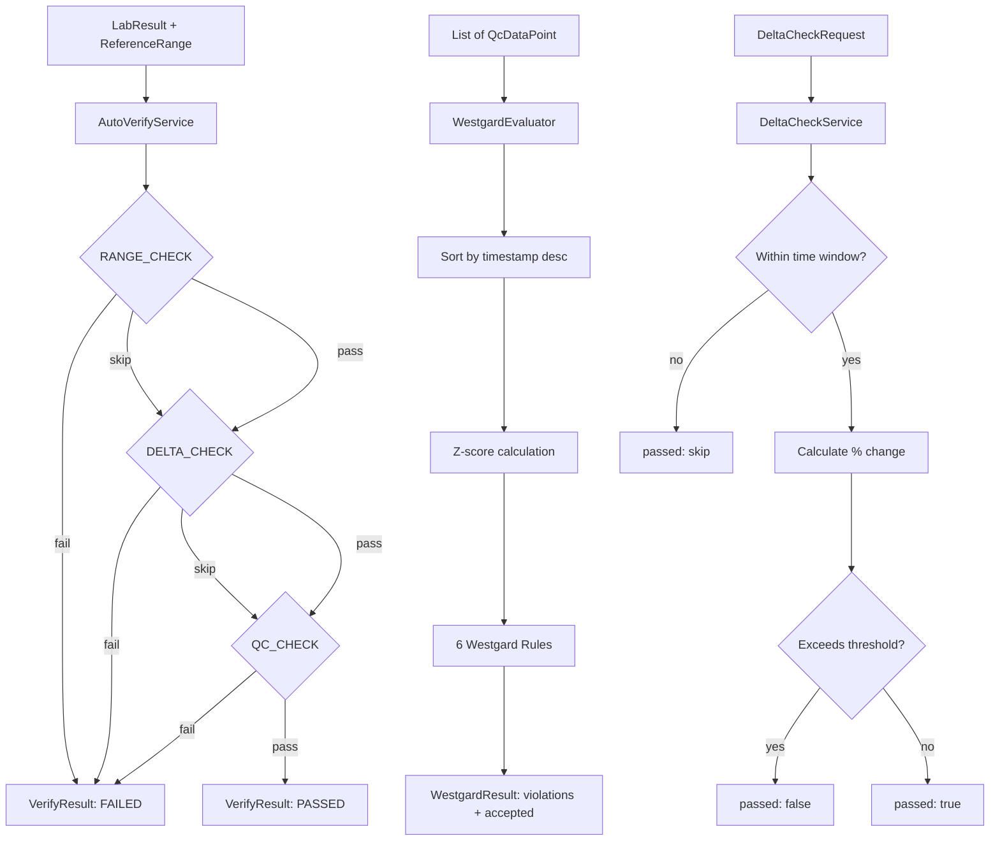

# lab-qc-engine

**lab-qc-engine** is a Laboratory Quality Control Engine – a pure Kotlin/Spring library implementing Westgard multi-rules, auto-verification, and delta checking for clinical laboratory information systems.

Designed for use in ISO 15189 and CAP-accredited laboratories.

## Features

### Westgard Multi-Rules
Six standard Westgard rules evaluated sequentially against Z-scores. Input data points are automatically sorted by timestamp (newest first) to guarantee correct consecutive-point evaluation regardless of input order.

| Rule   | Type    | Description                                                       |
|--------|---------|-------------------------------------------------------------------|
| 1-2s   | Warning | 1 control exceeds mean ± 2SD                                      |
| 1-3s   | Reject  | 1 control exceeds mean ± 3SD                                      |
| 2-2s   | Reject  | 2 consecutive controls exceed mean ± 2SD on the same side        |
| R-4s   | Reject  | Range between 2 consecutive controls exceeds 4SD                 |
| 4-1s   | Reject  | 4 consecutive controls exceed mean ± 1SD on the same side        |
| 10x    | Reject  | 10 consecutive controls fall on the same side of the mean        |

`WestgardEvaluator` is stateless - construct with `mean` + `sd`, call `evaluate(List<QcDataPoint>)`. `QcDataPoint` carries only `value` and `timestamp`.

### Auto-Verify
Sequential validation with early exit on first failure. Each step returns a structured `VerifyResult` with `VerifyStatus` (PASSED / FAILED / SKIPPED) for machine-readable decision routing:

1. **RANGE_CHECK** – numeric result within reference range
2. **DELTA_CHECK** – change from previous patient result within configured threshold
3. **QC_CHECK** – accepted QC result exists for this test today

`VerifyResult` preserves `DeltaCheckResult` details (percent change, absolute change) for audit and UI display.

### Delta Check
Percentage change from the most recent previous patient result within a configurable time window. Absolute change is also calculated. Skips automatically when the previous result falls outside the window.

`DeltaCheckServiceImpl` accepts `java.time.Clock` via constructor injection for deterministic testing and replay scenarios.

## Practical Use

**ISO 15189** requires laboratories to have procedures for accepting or rejecting QC results. Westgard rules are the internationally recognized framework for this.

**CAP** accreditation checklists require documented auto-verification logic with audit trails. This engine provides the rule evaluation core; the calling service is responsible for persistence and audit logging.

## Architecture



## Package Structure

```
com.labqc
├── westgard/      WestgardEvaluator, WestgardRule, WestgardResult, QcDataPoint
├── autoverify/    AutoVerifyService, AutoVerifyServiceImpl, VerifyRule, VerifyResult, VerifyStatus
├── delta/         DeltaCheckService, DeltaCheckServiceImpl, DeltaCheckRequest, DeltaCheckResult
└── model/         LabResult, ReferenceRange
```

## Build

```bash
./gradlew build
./gradlew test
```

Requires Java 21. No database dependencies – all I/O is the caller's responsibility.

## Design Decisions

- All numeric values use `BigDecimal` for precision - no floating-point rounding errors in clinical calculations.
- All domain models are `data class` for value semantics, equality, and copy support.
- `DeltaCheckServiceImpl` uses `java.time.Clock` injection - deterministic in tests, `Clock.systemUTC()` by default.
- `WestgardEvaluator` sorts input by timestamp - caller order does not affect consecutive-point rule evaluation.
- `VerifyResult` carries structured `VerifyStatus` enum - no string parsing needed by consumers.
- `VerifyResult` preserves `DeltaCheckResult` - no loss of domain information across orchestration boundaries.

## License

MIT - see [LICENSE](./LICENSE)
